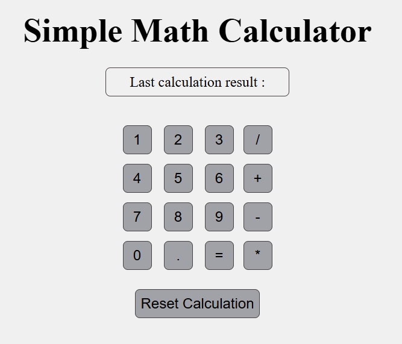

# Simple-Maths-Calculator

A responsive, web-based calculator for basic arithmetic operations, built with **HTML**, **CSS**, and **JavaScript**.  
Includes **persistent last-result storage** using `localStorage`.

------------------------------------------------------------------------------------------------

## 🚀 Live Demo
[View on GitHub Pages](https://sayyedhassanbacha-shb.github.io/Simple-Maths-Calculator/)

------------------------------------------------------------------------------------------------

## 📸 Screenshot


------------------------------------------------------------------------------------------------

## ✨ Features
- Perform basic arithmetic: addition (+), subtraction (-), multiplication (×), division (÷)
- Responsive design using `clamp()` for better cross-device support
- Stores last calculation result in `localStorage`
- Reset button to clear calculations and history
- Simple, user-friendly interface

------------------------------------------------------------------------------------------------

## 🛠️ Technologies Used
- **HTML5** –  Structure
- **CSS3** –  Styling, layout, and responsive design
- **JavaScript (ES6)** –  Calculator logic and localStorage persistence

------------------------------------------------------------------------------------------------

## 📂 Project Structure      
Simple-Maths-Calculator/             
├── assets/ # Calculator screenshot                     
│ └── calculator.png                  
├── src/ # Source code                    
│ ├── index.html # Main HTML file                     
│ ├── style.css # Stylesheet (if separated)                        
│ └── script.js # JavaScript logic (if separated)                         
├── README.md # Project documentation                         
└── .gitignore                                 

------------------------------------------------------------------------------------------------

## 📦 Installation & Usage

1. **Clone the repository**
    ```bash
   git clone https://github.com/yourusername/simple-math-calculator.git


2. **Navigate to the project folder**
    ```bash
    cd simple-math-calculator

3. **Open index.html in your browser**

------------------------------------------------------------------------------------------------

## 🔮 Future Improvements
- Replace eval() with a safer math expression parser
- Add keyboard input support
- Enhanced styling & animations

------------------------------------------------------------------------------------------------

## 📜 License
- This project is licensed under the [MIT License](LICENSE).

------------------------------------------------------------------------------------------------

## 👤 Author   
**Author:** Sayyed Hassan Bacha (SHB)  
- GitHub: https://github.com/SayyedHassanBacha-SHB/Simple-Maths-Calculator   
- Email: shbai.tech@gmail.com   
